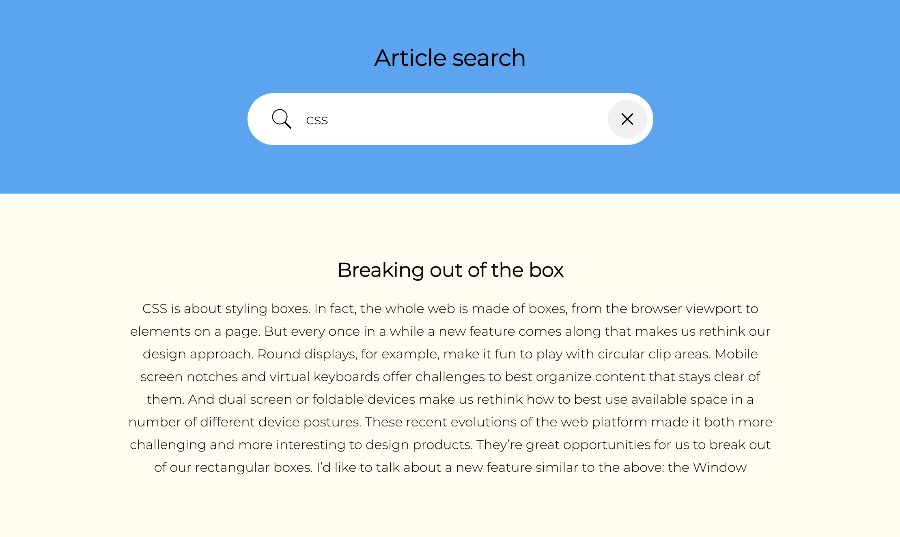

# Article search

This react application provides a way to quickly and easily search through a store of over articles.

The search uses boolean searching to return results that contain the keyword terms entered into the search box. Results are ordered by frequency - so the more keyword terms an article contains the more relevant it will be regarded. Searches have been limited to 10 results.



## Getting set up

### Generating the search index

The index.json in the repo has already been generated. But if required you can regenerate it by going to the **backend** directory and then running the command... 
```
node generateIndex.js
```

### Running the express server

cd to the **backend** directory

To install the project run 
```
npm install
```

To run the project run
```
PORT=3001 npm start
```

### Running the react application

cd to the **frontend** directory 

To install the project run 
```
npm install
```

To run the project run
```
npm start
```

### View in browser
With both the server and application running go to...
```
http://localhost:3000
```

### Running tests

I only wrote one test as an example.

To run the test cd to the **backend** directory and run the command
```
npm test
```

## What the generateIndex.js script does

- Reads all article txt files in the articles directory
- Loops through each file to extract a list of keywords
- Excludes any keywords that are contained in a stop list or are shorter than 3 characters in length
- Only includes words that contain letters
- Adds keywords and related ids (filenames) to the index object
- Writes the index to a JSON file


